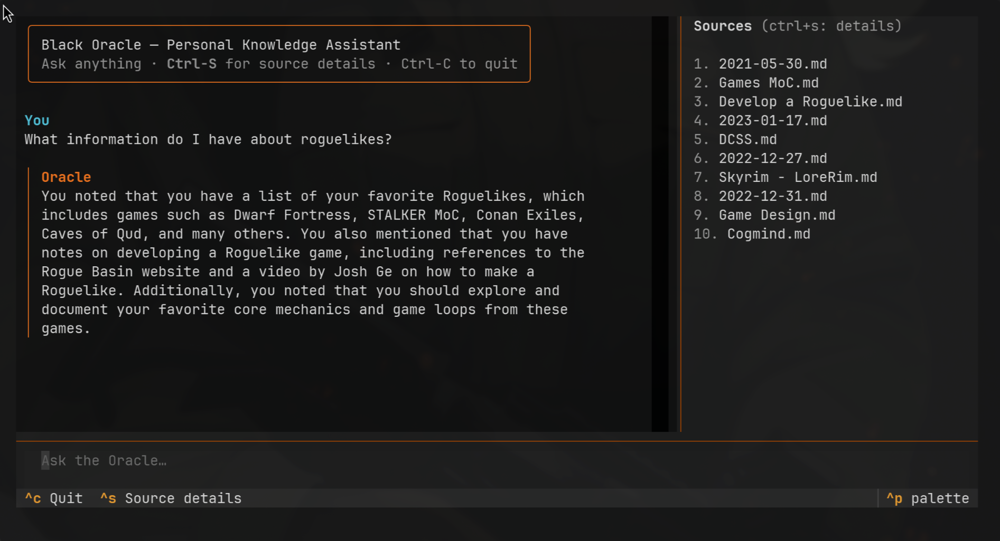

# Black Oracle

A local RAG (Retrieval-Augmented Generation) system for querying a personal
Obsidian PKM vault using a local LLM. All data stays on-device.

> Project ideation: [Google Gemini Pro session](https://gemini.google.com/app/89e20025d1622a80)



---

## Architecture

```
┌──────────────────────── INGESTION (offline) ─────────────────────────────┐
│                                                                          │
│  ┌──────────────┐     ┌────────────────────────────┐     ┌────────────┐  │
│  │Obsidian Vault│────▶│  ingestion_pipeline.py     │────▶│  ChromaDB  │  │
│  │./data/*.md   │     │  Dagster                   │     │./chroma_db/│  │
│  └──────────────┘     │  load → chunk → embed      │     └────────────┘  │
│                       │  (HuggingFace MiniLM-L6-v2)│                     │
│                       └────────────────────────────┘                     │
└──────────────────────────────────────────────────────────────────────────┘
                                                          │
                                                 persisted vectors
                                                          │
┌──────────────────────── INFERENCE (online) ──────────────────────────────┐
│                                                          ▼               │
│  ┌──────────────────┐  question   ┌────────────┐   ┌────────────┐        │
│  │     chat.py      │────────────▶│ oracle.py  │──▶│  ChromaDB  │        │
│  │   Textual TUI    │  +history   │  FastAPI   │◀──│  (k=10)    │        │
│  │  (chat_history)  │◀────────────│  :8000     │   └────────────┘        │
│  └──────────────────┘  answer     │            │   ┌────────────┐        │
│                        +sources   │ POST /chat │──▶│   Ollama   │        │
│                                   └────────────┘◀──│   llama3   │        │
│                                                    └────────────┘        │
└──────────────────────────────────────────────────────────────────────────┘
```

---

## How it works

1. **Ingestion** (run once, or when notes change): A Dagster pipeline loads
   all `.md` files from the vault, splits them into chunks, embeds them with
   HuggingFace, and stores the vectors in ChromaDB.

2. **Inference** (run anytime): A FastAPI server retrieves relevant chunks
   from ChromaDB and generates answers via a local Ollama model.

---

## Prerequisites

- [Ollama](https://ollama.com) installed and running
- Python 3.11+
- `./data` symlinked to your Obsidian vault (directory of `.md` files)

Pull the LLM model before first use:

```bash
ollama pull llama3
```

### Alternative: Docker-based infrastructure

Instead of running Ollama and ChromaDB natively, you can bring them up with
Docker:

```bash
docker run -d -p 8000:8000 chromadb/chroma
docker run -d -v ollama:/root/.ollama -p 11434:11434 ollama/ollama
```

---

## Setup

```bash
uv sync
```

---

## Cold start

`cold-start.sh` brings up the full serving stack (Ollama + FastAPI) in the
background and exits once everything is healthy. All service output is
redirected to `/tmp/` — you don't need to keep the terminal open.

```bash
./cold-start.sh
```

Then, in the same terminal (or any other):

```bash
python chat.py
```

If you also need to re-ingest your vault (first run, or after notes have
changed), add `--dagster` to start the Dagster UI too:

```bash
./cold-start.sh --dagster
# open http://localhost:3000 → Lineage → Materialize All
# then: python chat.py
```

The script is idempotent — safe to re-run if services are already up. Logs
land in `/tmp/black-oracle-api.log` and `/tmp/black-oracle-dagster.log`.

If a service fails to come up, re-run with `--debug` to see its output
directly in the terminal instead of a log file:

```bash
./cold-start.sh --debug
./cold-start.sh --dagster --debug
```

ChromaDB is file-based (`./chroma_db/`) and needs no separate service.

### Bring down

The services run as background processes. To stop them:

```bash
# Stop FastAPI and Dagster (if running)
pkill -f "oracle.py" 2>/dev/null || true
pkill -f "dagster dev" 2>/dev/null || true

# Stop Ollama (only if you started it via cold-start.sh)
pkill -f "ollama serve" 2>/dev/null || true
```

If Ollama was already running before you called `cold-start.sh`, leave it
running — the script does not own that process.

---

## Usage

### 1. Ingest your vault

```bash
dagster dev -f ingestion_pipeline.py
```

Open [localhost:3000](http://localhost:3000), go to **Lineage**, and click
**Materialize All**. This populates ChromaDB at `./chroma_db/`. Re-run
whenever your notes change significantly.

### 2. Start the inference server

```bash
./cold-start.sh
```

Server runs at [localhost:8000](http://localhost:8000). See [Cold start](#cold-start) above for details.

### 3. Query

**Single-shot (non-conversational):**

```bash
bash test_inference.sh
# or manually:
curl -X POST "http://localhost:8000/ask" \
     -H "Content-Type: application/json" \
     -d '{"question": "Your question here"}'
```

**Conversational chat (maintains history across turns):**

```bash
python chat.py
```

Press `Ctrl+S` to toggle source previews in the right-hand panel. Ctrl+C to exit.

> **Selecting and copying text:** Textual captures mouse events, so normal
> click-to-select doesn't work. Hold **Shift** while clicking and dragging to
> pass mouse events through to the terminal and select text the usual way.
> See the [Textual FAQ](https://textual.textualize.io/FAQ/#how-can-i-select-and-copy-text-in-a-textual-app) for details.

---

## Components

| File | Role |
|---|---|
| `ingestion_pipeline.py` | Dagster pipeline: load → chunk → embed → store in ChromaDB |
| `oracle.py` | FastAPI server: `/ask` (stateless) and `/chat` (conversational) endpoints |
| `test_inference.sh` | Single-shot CLI query tool |
| `chat.py` | Interactive multi-turn chat UI (uses `rich` for formatting) |
| `test_retrieval.py` | Direct ChromaDB retrieval test (no LLM) |

### Endpoints

- `POST /ask` — stateless RAG query; returns `answer` + `sources`
- `POST /chat` — conversational RAG; accepts `question` and
  `chat_history` (`[[human, ai], ...]`); returns `answer` + `sources`

### LangChain version note

This project uses `langchain_classic.chains` (not `langchain.chains`) due to
breaking API changes in LangChain v1.0. Keep this in mind when adding new
LangChain functionality.

---

## Future Potential Work

- **Server-side conversation state**: The `/chat` endpoint requires the client to send the full `chat_history` on every turn. A session-keyed store with a max-history limit would offload that burden and prevent unbounded prompt growth.

- **Incremental ingestion**: The Dagster pipeline rebuilds the entire ChromaDB collection on every run. An upsert strategy — hashing chunks by `(source, start_index)` and only embedding new/changed ones — would make re-ingestion practical for large or frequently-updated vaults.

- **Token budget guard for `k=10`**: Stuffing 10 chunks into the prompt can overflow the LLM's context window on long documents. Either add a dynamic token budget check or switch to a `map_reduce` or `refine` chain type for larger result sets.

- **Migrate off `langchain_classic`**: `langchain_classic` is a compatibility shim for pre-v1.0 LangChain APIs. Migrating to LCEL (LangChain Expression Language) pipelines would restore active maintenance, improve composability, and unlock async streaming out of the box.

- **Structured error handling**: Both endpoints catch all exceptions and return HTTP 500 with `str(e)`. ChromaDB connection failures, Ollama timeouts, and malformed inputs should produce distinct status codes and be logged separately.

- **Smaller, more focused chunks**: The current 1000-char chunk size often spans multiple ideas. Reducing to ~400–500 chars with proportionally less overlap tends to produce tighter, more on-topic retrieval matches. Requires re-ingestion.
